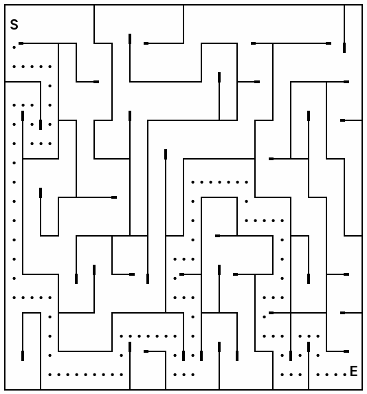

# Mazes are amazing

This project attempts to implement a maze generator and solver using Depth-first Search
and Breadth-first Search.

* Using Depth-first Search, mazes with a random structure is generated.
Comments in code [from Wikipedia](https://en.wikipedia.org/wiki/Depth-first_search).

* Using Breadth-first Search, a path from the beginning to the end is (hopefully) found. Comments in code [from Wikipedia](https://en.wikipedia.org/wiki/Breadth-first_search).

## Usage

```
npm install

npm run build

npm run demo

```

## Output




